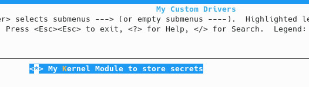

# Журнал работ 

Изначально было принято решение ознакомиться с теоретическим материалом по теме: "Пособие по программированию модулей ядра Linux".

Следующим шагом стало продумывание структуры записи в procfs. Сам секрет состоит из текстовых данных, записанных в него, и целочисленного идентификатора, с помощью которого можно взаимодействовать с записью в procfs. Изначально рассматривались две идеи присваивания идентификатора секретам: он назначается автоматически либо это делает пользователь. Выбор был сделан в пользу второго варианта, чтобы сам id использовался как некий секретный ключ, известеный только его автору, по которому можно прочитать записанные данные. Кроме того, необходимо было принять решение, должна ли структура секрета содержать поле id или нет. Однозначным достоинством такого поля является возможность дальнейшей масштабируемости проекта - для хранения большого числа секретов можно использовать дерево, в котором обращение к элементу будет осуществляться по этому id. Но после некоторого анализа был сделан вывод, что количество секретов, по своей сути, не должно быть невероятно большим. Это означает, что для их хранения можно воспользоваться статическим массивом, который ограничивает их максимальное число, и, следовательно, в качестве идентификатора секрета можно использовать его порядковый номер в массиве.

После этого я начал заниматься написанием модуля ядра, который поддерживает операции записи и чтения секретов в procfs. Изначально операция чтения секретов в модуле ядра выводила все существующие секреты для удобства отладки, а реализация чтения секретов по id реализовывалась бы в пользовательской программе.

Затем было необходимо добавить возможность удалять существующие секреты по их идентификаторам. Было принято решение использовать ключи D (delete) и C (create) для соответствующих операций.

После того, как был написан рабочий модуль ядра для хранения секретов и Makefile для его сборки, было необходимо написать userspace-программу для взаимодействия с написанным модулем.

Когда и модуль ядра, и userspace-программа были готовы, появилась воможность полноценно проверить работу модуля ядра. После тестирования было принято решение изменить логику работы операции чтения. По моему мнению, идеологически более верным является реализация возможности чтения секрета по его идентификатору внутри модуля ядра, а не получение всего списка секретов с его последующей фильтрацией по id.

Последним шагом стало внесение изменений в код функции чтения внутри модуля ядра и пользовательской программы и тестирование работы итоговой версии проекта.

### Бонусное задание

Чтобы собрать ядро с ранее написанным модулем ядра, произвел следующие шаги:

- внутри директории с исходниками ядра создал подкаталог drivers/secrets_module;
- в этот дочерний каталог скопировал файл с кодом модуля secrets_module.c и Makefile для него;

  

 

- в файл drivers/Makefile добавил строку *obj-$(CONFIG_MYMODULE) += secrets_module/*

  

 

- в файл drivers/Kconfig добавил следующие строки:

  

  

- после этого в menuconfig можно пройти по пути *My Custom Drivers* и включить поддержку собственного модуля:

  

- для поддержки KASAN изменим .config, добавив строку  CONFIG_KASAN=y:

  

- скомпилировал ядро с помощью *make* и *make modules_install*.
  